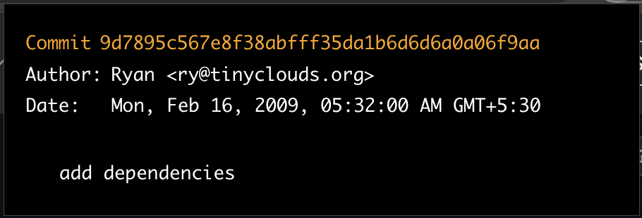
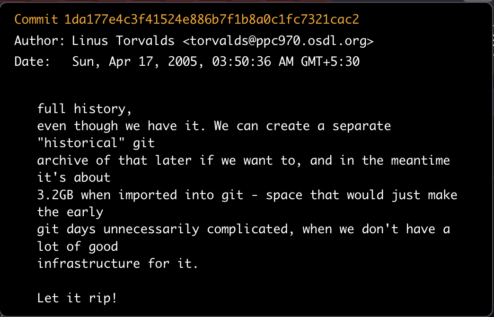

# FirstCommit – Git Blade for GitHub

A tiny WXT + React browser extension that shows the very first commit of
the current GitHub repository in a git-log styled popup.
Built for fun and curiosity—like git blame, but even less useful. Hence: git blade.

## Why

When learning from a project, I often read the official README and docs.
Sometimes I also want to know who made the first commit and what that initial
commit looked like. This extension answers that in one click.

## Features

- Detects if the active tab is a GitHub repository
- Finds the repo's default branch and fetches the very first commit
- Displays commit in terminal-like git log style (hash, author, date, message)

## Screenshots




## Getting Started (Development)

Requirements: Node 18+.

Install dependencies and start in Chrome dev mode:

```sh
npm i
npm run dev
```

Firefox dev mode:

```sh
npm run dev:firefox
```

## Build

Production builds:

```sh
npm run build            # Chrome (mv3)
npm run build:firefox    # Firefox
```

## Zips for Submission

Following WXT publishing guidance:

```sh
npm run zip              # Chrome/Edge ZIP
npm run zip:firefox      # Firefox ZIP + sources ZIP
```

WXT will generate files in `.output/`. For Firefox, a sources ZIP is also created which reviewers use to rebuild our extension. Ensure the sources ZIP can be built on its own:

```sh
npm i
npm run zip:firefox
```

## Permissions

- `activeTab` – to read the current tab URL and detect GitHub.

No background networking beyond GitHub’s public API.

## Known Limitations / Edge Cases

- Private repos are not handled (requires auth; out of scope for first release)
- Extremely large repos may take a moment to resolve the first commit
- GitHub API rate limiting can temporarily block requests

## Tech Stack

- [WXT](https://wxt.dev/) (MV3 build, zips, and submit tooling)
- React 19, TypeScript 5

## License

MIT
